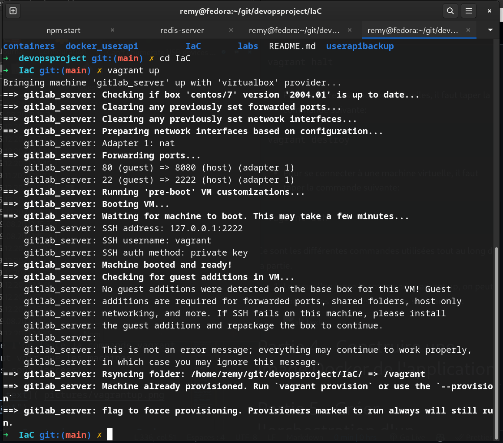
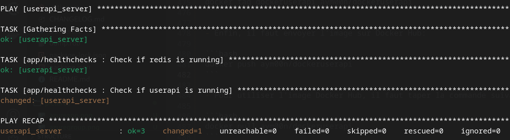

# Partie 3 - Configurer et approvisionner un environnement virtuel qui lance notre application en utilisant une approche IaC.

Pour utiliser l'infrastucture as code, nous avons choisi d'utiliser Vagrant.

## Installation

- Pour installer Vagrant, il faut d'abord installer [VirtualBox](https://www.virtualbox.org/wiki/Downloads).

- Vous pouvez aussi utiliser d'autres hyperviseurs comme VMware, Hyper-V, etc.

- Puis installer [Vagrant](https://www.vagrantup.com/downloads).

## Utilisation

- Pour utiliser Vagrant, il faut créer un fichier Vagrantfile. Dans ce fichier, on peut définir les machines virtuelles, les configurations, les réseaux, etc.

- Il se trouvera dans le dossier /IaC.

- Pour lancer les fichiers il faut se placer dans le dossier /IaC et taper la commande suivante:

```bash
vagrant up
```

- Pour arrêter les machines virtuelles, il faut taper la commande suivante:

```bash
vagrant halt
```

- Pour détruire les machines virtuelles, il faut taper la commande suivante:

```bash
vagrant destroy
```

- Pour se connecter à une machine virtuelle, il faut taper la commande suivante:

```bash
vagrant ssh
```

Ce sont les différentes commandes utilisées tout au long de la partie.

1. Lorsque l'on lance la commande vagrant up, on peut voir que les machines virtuelles sont lancées:

   

   - Sur VirtualBox : 

2. L'OS de la machine virtuelle est Bionic64 proposé par Vagrant.

   - Bionic64 est une distribution Linux basée sur Ubuntu 18.04

   - Nous avons choisit cette distribution puisqu'elle est très utilisé dans le monde de l'entreprise.

3. Concernant le deployment et le provisionement, nous avons utilisé Ansible.

   - Ansible est un outil de configuration et de gestion de serveurs.

   - Il permet de déployer et de configurer des machines virtuelles.

   - Il est aussi très utilisé dans le monde de l'entreprise.

Lorsque l'on lance vagrant up, Ansible est aussi lancé, il est configuré dasn le fichier Vagrantfile.

Il approvisionne la mise en place grâce aux Ansible Playbooks contenu dans le dossier /IaC/playbooks.

Un playbook est un fichier YAML qui est utilisé pour décrire les tâches à effectuer sur les machines virtuelles.

Il télécharge et installe les paquets nécessaires pour le bon fonctionnement de l'application.

4.  Pour tester notre système:

- On lance la commande:

```bash
   vagrant up
```

Cela prend un peu temps car il faut télécharger les images des machines virtuelles et installer les paquets.

Ici, la commande a effectué les memes commandes pour lancer l'application que dans la partie 1.
(Lancer redis, npm install, npm start dans la VM)

- l'appication est disponible sur le port 3000 : [http://localhost:3000](http://localhost:3000)

- On peut se connecte à la machine virtuelle pour tester le bon fonctionnement de l'application:

```bash
   vagrant ssh
```

- L'on peut aussi effectuer une requete CURL pour tester le bon fonctionnement de l'application:

```bash
curl --header "Content-Type: application/json" \
  --request POST \
  --data '{"username":"Aym00n","firstname":"Remy","lastname":"Jovanovic"}' \
  http://localhost:3000/user
```

Ce qui nous donne:

```bash
{"status":"success","msg":"OK"}
```

5. Pour vérifier l'état système

- On reste dans le dossier /IaC

- Puis l'on se connecte à la machine virtuelle:

```bash
   vagrant ssh
```

- Et l'on tape la commande:

```bash
ansible-playbook /vagrant/playbooks/run.yml --tags TAG -i /tmp/vagrant-ansible/inventory/vagrant_ansible_local_inventory
```

- TAG est le nom du tag que l'on veut tester.

- Donc dans notre cas : check

```bash
ansible-playbook /vagrant/playbooks/run.yml --tags check -i /tmp/vagrant-ansible/inventory/vagrant_ansible_local_inventory
```

- On peut voir que le système est en bon état:

  