# Devopsproject

## Introduction

## Instructions pour installation

1. [Installer Git](https://git-scm.com/downloads)

2. [Installer NodeJS](https://nodejs.org/en/download/)

3. [Installer Docker](https://docs.docker.com/engine/install/)

# Partie 1 - Créer une application Web.

## Prérequis

- NodeJS
- Git
- Redis

## Installation

1. Cloner le projet

```bash
git clone git@github.com:aym00n-djrak/devopsproject.git
```

3. Se déplacer dans le dossier du projet

```bash
cd devopsproject
```

4. Puis dans l'api: userapi

```bash
cd userapi
```

5. Installer les dépendances

```bash
npm install
```

6. Lancer Redis

```bash
redis-server
```

- Résultat attendu:

  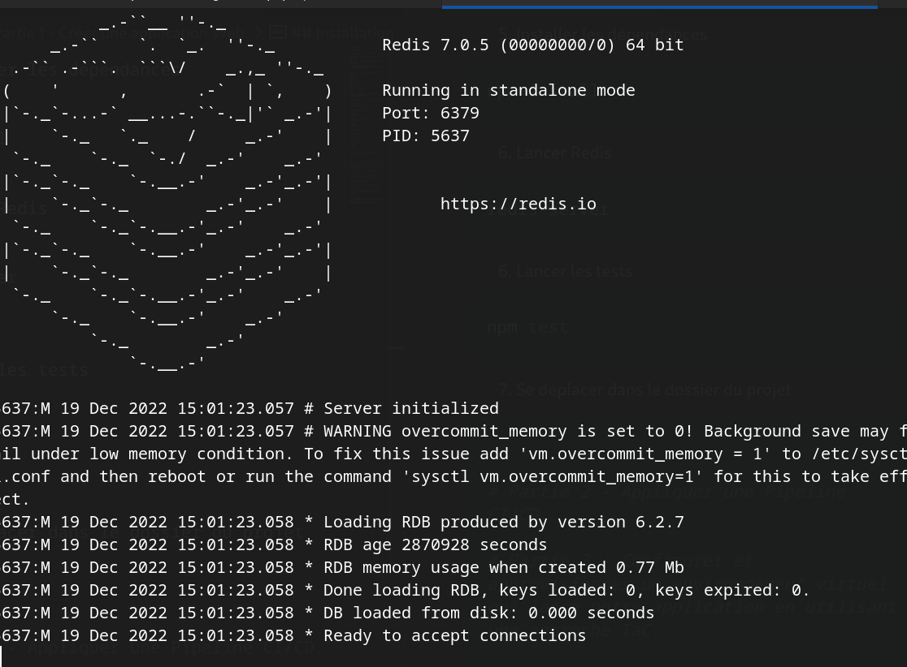

6. Lancer les tests

```bash
npm test
```

- Résultat attendu:

  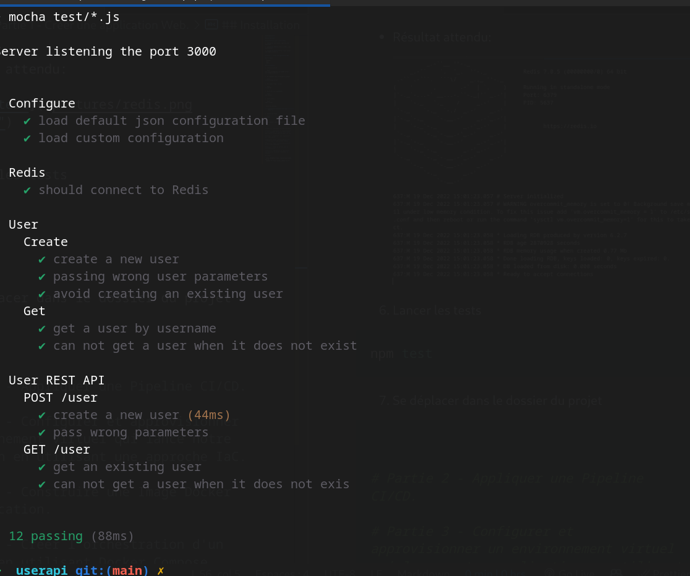

7. Lancer l'application finale

```bash
npm start
```

- Résultat attendu:

  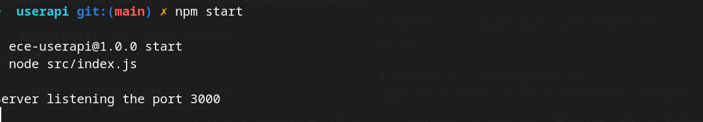

- Sortie sur le navigateur: [localhost:3000](http://localhost:3000)

  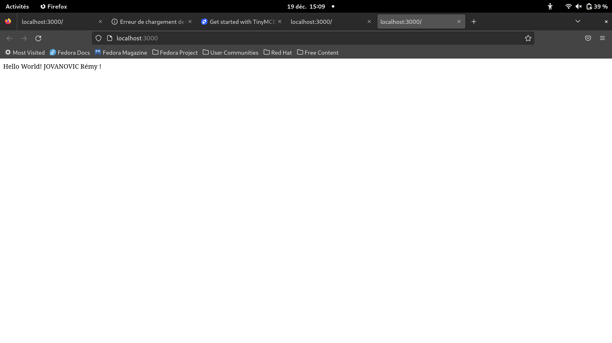

- On peut effectuer une commande curl pour observer si la base de données Redis est bien remplie:

```bash
curl --header "Content-Type: application/json" \
  --request POST \
  --data '{"username":"Aym00n","firstname":"Remy","lastname":"Jovanovic"}' \
  http://localhost:3000/user
```

- Sortie sur le terminal:

  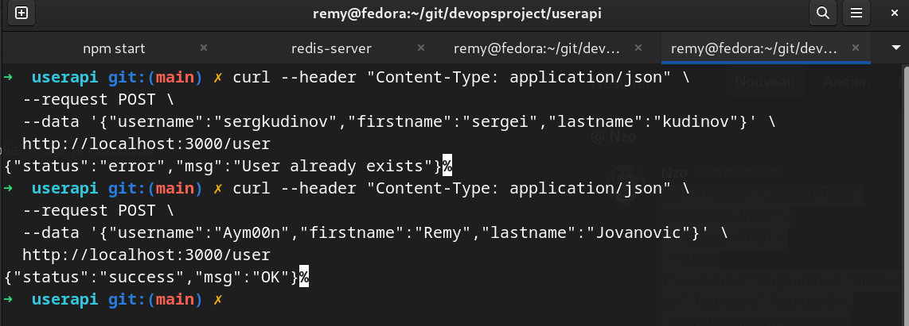

# Partie 2 - Appliquer une Pipeline CI/CD.

## Prérequis

- Github
- Heroku
- Azure

## Installation

1. Se déplacer dans le dossier du projet

```bash
cd devopsproject
```

2. En utilisant Github Actions, on peut voir que la pipeline est bien lancée :

   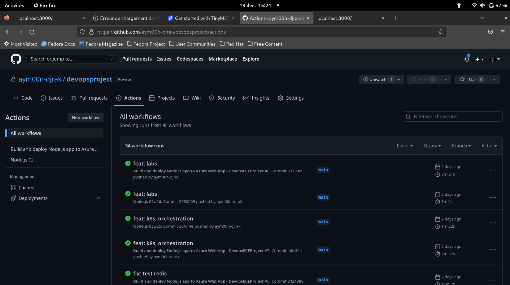

## Heroku :

1. On observe ci dessous le workflow de la pipeline Heroku:

   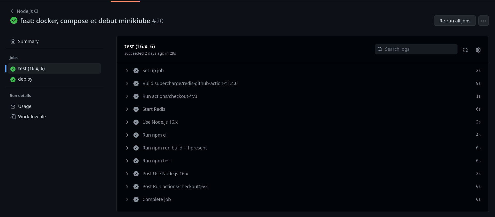

- Ici le code du workflow est le suivant:

```yaml
name: Node.js CI

on:
  push:
    branches: ["main"]
  pull_request:
    branches: ["main"]

jobs:
  test:
    runs-on: ubuntu-latest
    defaults:
      run:
        working-directory: userapi

    strategy:
      matrix:
        node-version: [16.x]
        # See supported Node.js release schedule at https://nodejs.org/en/about/releases/
        redis-version: [6]

    steps:
      - uses: actions/checkout@v3
      - name: Start Redis
        uses: supercharge/redis-github-action@1.4.0
        with:
          redis-version: ${{ matrix.redis-version }}

      - name: Use Node.js ${{ matrix.node-version }}
        uses: actions/setup-node@v3
        with:
          node-version: ${{ matrix.node-version }}
          cache: "npm"
          cache-dependency-path: "**/package-lock.json"
      - run: npm ci
      - run: npm run build --if-present
      - run: npm test

  deploy:
    needs: test
    runs-on: ubuntu-latest

    steps:
      - uses: actions/checkout@v2
      - uses: akhileshns/heroku-deploy@v3.12.12 # This is the action
        with:
          heroku_api_key: ${{secrets.HEROKU_API_KEY}}
          heroku_app_name: "devopsprojectjovayu" #Must be unique in Heroku
          heroku_email: "remyj@outlook.fr"
          appdir: userapi
```

2. On peut voir que la pipeline est bien lancée sur Heroku:

   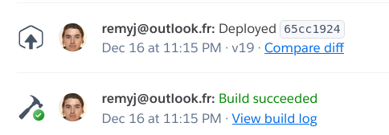

- Sur le lien de l'application:

  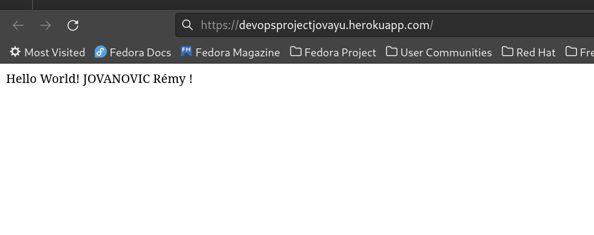

- L'application est actuellement désactivée suite au dépassement de la limite de temps d'utilisation gratuite de Heroku.

- L'application est aujourd'hui payante et les services Redis sont désactivés.

- L'application est donc désactivée (pour ne pas engendrer des frais supplémentaires).

## Azure :

1. On observe ci dessous le workflow de la pipeline Azure:

   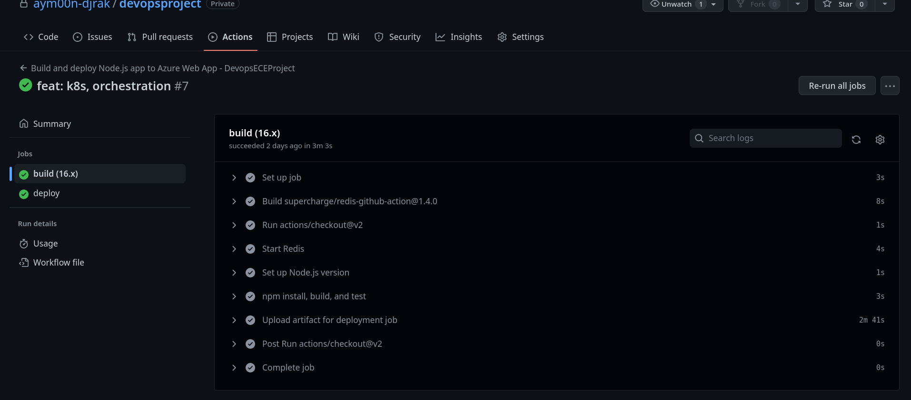

- Ici le code du workflow est le suivant:

```yaml
# Docs for the Azure Web Apps Deploy action: https://github.com/Azure/webapps-deploy
# More GitHub Actions for Azure: https://github.com/Azure/actions

name: Build and deploy Node.js app to Azure Web App - DevopsECEProject

on:
  push:
    branches:
      - main
  workflow_dispatch:

jobs:
  build:
    runs-on: ubuntu-latest
    defaults:
      run:
        working-directory: userapi

    strategy:
      matrix:
        node-version: [16.x]

    steps:
      - uses: actions/checkout@v2
      - name: Start Redis
        uses: supercharge/redis-github-action@1.4.0
        with:
          redis-version: ${{ matrix.redis-version }}

      - name: Set up Node.js version
        uses: actions/setup-node@v1
        with:
          node-version: "16.x"

      - name: npm install, build, and test
        run: |
          npm install
          npm run build --if-present
          npm run test --if-present
      - name: Upload artifact for deployment job
        uses: actions/upload-artifact@v2
        with:
          name: node-app
          path: .

  deploy:
    runs-on: ubuntu-latest
    needs: build
    environment:
      name: "Production"
      url: ${{ steps.deploy-to-webapp.outputs.webapp-url }}

    steps:
      - name: Download artifact from build job
        uses: actions/download-artifact@v2
        with:
          name: node-app

      - name: "Deploy to Azure Web App"
        id: deploy-to-webapp
        uses: azure/webapps-deploy@v2
        with:
          app-name: "DevopsECEProject"
          slot-name: "Production"
          publish-profile: ${{ secrets.AZUREAPPSERVICE_PUBLISHPROFILE_4FD3A5384FCE443E9F4C572405944A5C }}
          package: .
```

- Voici la structure de notre groupe Azure:

  

- Concernant l'insertion de Redis dans Azure, nous n'avons pas compris comment ajouter le service dans la Web App.
  Nous avons donc ajouté le module au group et déployé l'application sur le groupe.

- Nous n'avons pas remarqué d'erreur lors du déployement.

  - Le voici: 

2. On peut voir que l'application est bien lancé:

   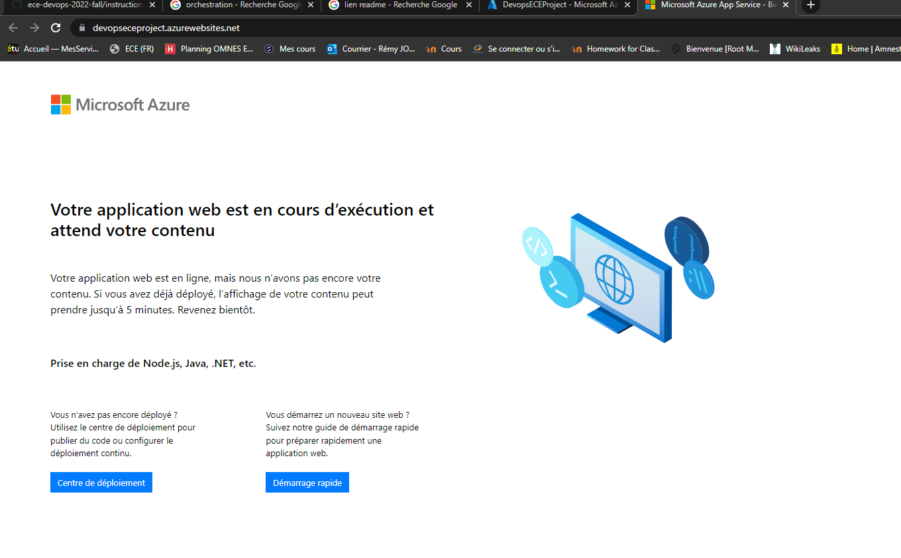

# Partie 3 - Configurer et approvisionner un environnement virtuel qui lance notre application en utilisant une approche IaC.

Pour utiliser l'infrastucture as code, nous avons choisi d'utiliser Vagrant.

## Installation

- Pour installer Vagrant, il faut d'abord installer [VirtualBox](https://www.virtualbox.org/wiki/Downloads).

- Vous pouvez aussi utiliser d'autres hyperviseurs comme VMware, Hyper-V, etc.

- Puis installer [Vagrant](https://www.vagrantup.com/downloads).

## Utilisation

- Pour utiliser Vagrant, il faut créer un fichier Vagrantfile. Dans ce fichier, on peut définir les machines virtuelles, les configurations, les réseaux, etc.

- Il se trouvera dans le dossier /IaC.

- Pour lancer les fichiers il faut se placer dans le dossier /IaC et taper la commande suivante:

```bash
vagrant up
```

- Pour arrêter les machines virtuelles, il faut taper la commande suivante:

```bash
vagrant halt
```

- Pour détruire les machines virtuelles, il faut taper la commande suivante:

```bash
vagrant destroy
```

- Pour se connecter à une machine virtuelle, il faut taper la commande suivante:

```bash
vagrant ssh
```

Ce sont les différentes commandes utilisées tout au long de la partie.

1. Lorsque l'on lance la commande vagrant up, on peut voir que les machines virtuelles sont lancées:

   

   - Sur VirtualBox : 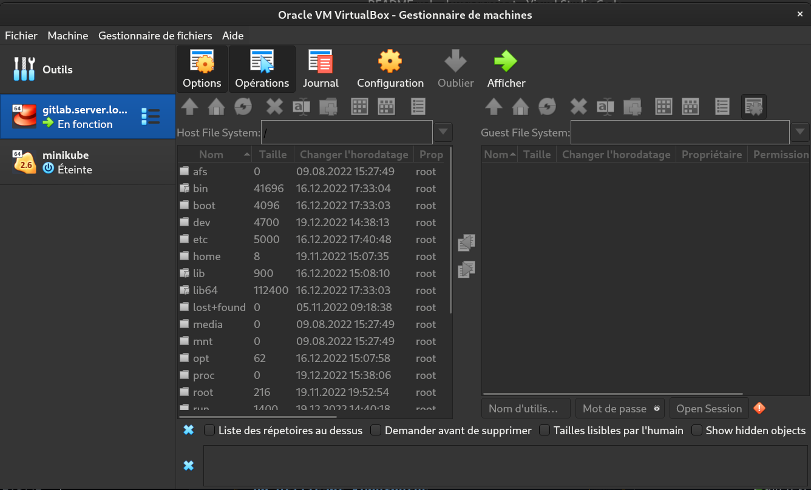

2. L'OS de la machine virtuelle est Bionic64 proposé par Vagrant.

   - Bionic64 est une distribution Linux basée sur Ubuntu 18.04

   - Nous avons choisit cette distribution puisqu'elle est très utilisé dans le monde de l'entreprise.

3. Concernant le deployment et le provisionement, nous avons utilisé Ansible.

   - Ansible est un outil de configuration et de gestion de serveurs.

   - Il permet de déployer et de configurer des machines virtuelles.

   - Il est aussi très utilisé dans le monde de l'entreprise.

Lorsque l'on lance vagrant up, Ansible est aussi lancé, il est configuré dasn le fichier Vagrantfile.

Il approvisionne la mise en place grâce aux Ansible Playbooks contenu dans le dossier /IaC/playbooks.

Un playbook est un fichier YAML qui est utilisé pour décrire les tâches à effectuer sur les machines virtuelles.

Il télécharge et installe les paquets nécessaires pour le bon fonctionnement de l'application.

4.  Pour tester notre système:

- On lance la commande:

```bash
   vagrant up
```

Cela prend un peu temps car il faut télécharger les images des machines virtuelles et installer les paquets.

Ici, la commande a effectué les memes commandes pour lancer l'application que dans la partie 1.
(Lancer redis, npm install, npm start dans la VM)

- l'appication est disponible sur le port 3000 : [http://localhost:3000](http://localhost:3000)

- On peut se connecte à la machine virtuelle pour tester le bon fonctionnement de l'application:

```bash
   vagrant ssh
```

- L'on peut aussi effectuer une requete CURL pour tester le bon fonctionnement de l'application:

```bash
curl --header "Content-Type: application/json" \
  --request POST \
  --data '{"username":"Aym00n","firstname":"Remy","lastname":"Jovanovic"}' \
  http://localhost:3000/user
```

Ce qui nous donne:

```bash
{"status":"success","msg":"OK"}
```

5. Pour vérifier l'état système

- On reste dans le dossier /IaC

- Puis l'on se connecte à la machine virtuelle:

```bash
   vagrant ssh
```

- Et l'on tape la commande:

```bash
ansible-playbook /vagrant/playbooks/run.yml --tags TAG -i /tmp/vagrant-ansible/inventory/vagrant_ansible_local_inventory
```

- TAG est le nom du tag que l'on veut tester. 

- Donc dans notre cas : check

```bash
ansible-playbook /vagrant/playbooks/run.yml --tags check -i /tmp/vagrant-ansible/inventory/vagrant_ansible_local_inventory
```

- On peut voir que le système est en bon état:

    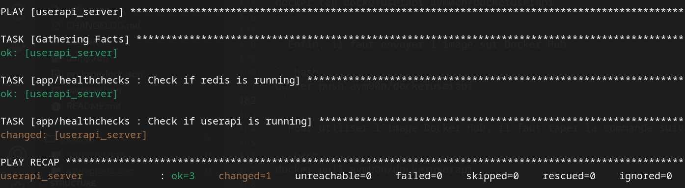

# Partie 4 - Construire une Image Docker de l'application.

 
## Prérequis

Pour pouvoir utiliser Docker, il faut installer les outils suivants:

- Docker [https://docs.docker.com/install/](https://docs.docker.com/install/)
- Redis [https://redis.io/download](https://redis.io/download)

## Installation

- Pour installer Docker, il faut suivre les instructions sur le site officiel.

- Pour installer Redis, il faut suivre les instructions sur le site officiel.

## Utilisation

1. Lancer redis dans un premier temps:

```bash
redis-server
```

2. Lancer l'application avec docker:

- Pour utiliser Docker, il faut créer un fichier Dockerfile. Dans ce fichier, on peut définir les instructions pour construire l'image.

- Pour créer l'image (notre image dockeruserapi), il faut se placer dans le dossier de l'application et taper la commande suivante:

```bash
cd docker_userapi
docker build -t dockeruserapi .
```

- Pour lancer l'application, il faut taper la commande suivante:

```bash
docker run -p 3001:3001 dockeruserapi
```

- L'application est maintenant disponible sur le port 3001 : [http://localhost:3001](http://localhost:3001)

## Utilisation de l'image Docker Hub

- Pour envoyer l'image sur Docker Hub, il faut se connecter à son compte Docker Hub.

- Puis taper la commande suivante:

```bash
docker login
```

- Ensuite, il faut tagger l'image avec le nom de l'utilisateur Docker Hub:

```bash
docker tag dockeruserapi aym00n/dockeruserapi
```

- Enfin, il faut envoyer l'image sur Docker Hub:

```bash
docker push aym00n/dockeruserapi
```

- Pour utiliser l'image Docker Hub, il faut taper la commande suivante:

```bash
docker pull aym00n/dockeruserapi
```

- Puis lancer l'application avec docker:

```bash
docker run -p 3001:3001 aym00n/dockeruserapi
```

- L'application est maintenant disponible sur le port 3001 : [http://localhost:3001](http://localhost:3001)


On peut la tester avec la méthode CURL que pour IaC.

# Partie 5 - Créer l'orchestration d'un conteneur en utilisant Docker Compose.

## Prérequis

Pour pouvoir utiliser Docker Compose, il faut installer les outils suivants:

- [Docker](https://docs.docker.com/install/)
- [Docker Compose](https://docs.docker.com/compose/install/)
- [Redis](https://redis.io/download)


## Installation

- Pour installer Docker, il faut suivre les instructions sur le site officiel.

- Pour installer Docker Compose, il faut suivre les instructions sur le site officiel.

- Pour installer Redis, il faut suivre les instructions sur le site officiel.

## Utilisation

- Pour utiliser Docker Compose, il faut créer un fichier docker-compose.yml. Dans ce fichier, on peut définir les instructions pour construire l'image et lancer l'application.

- Pour créer l'image et lancer l'application, il faut se placer dans le dossier de l'application et taper la commande suivante:

```bash
cd dockercompose_userapi
docker-compose up
```

- L'application est maintenant disponible sur le port 3001 : [http://localhost:3001](http://localhost:3001)

- Pour arrêter l'application, il faut taper la commande suivante:

```bash
docker-compose down
```

- On peut la tester avec la méthode CURL suivante :
    
    ```bash
    curl --header "Content-Type: application/json" \
      --request POST \
      --data '{"username":"Aym00n","firstname":"Remy","lastname":"Jovanovic"}' \
      http://localhost:3001/user
    ```

- La réponse est la suivante :

    ```bash
    {"status": "success", "msg": "OK"}
    ```

# Partie 6 - Faire l'orchestration Docker en utilisant Kubernetes.

## Prérequis

Pour pouvoir utiliser Kubernetes, il faut installer les outils suivants:

- [Docker](https://docs.docker.com/install/)
- [Kubernetes](https://kubernetes.io/docs/tasks/tools/install-kubectl/)
- [Minikube](https://kubernetes.io/docs/tasks/tools/install-minikube/)
- [Redis](https://redis.io/download)


# Partie 7 - Créer un service mesh en utilisant Istio.

# Partie 8 - Implémenter un système de monitoring en utilisant Prometheus et Grafana.

## Auteurs

- Rémy JOVANOVIC E-mail:remy.jovanovic@edu.ece.fr
- Shihao YU E-mail:shihao.yu@edu.ece.fr


````
