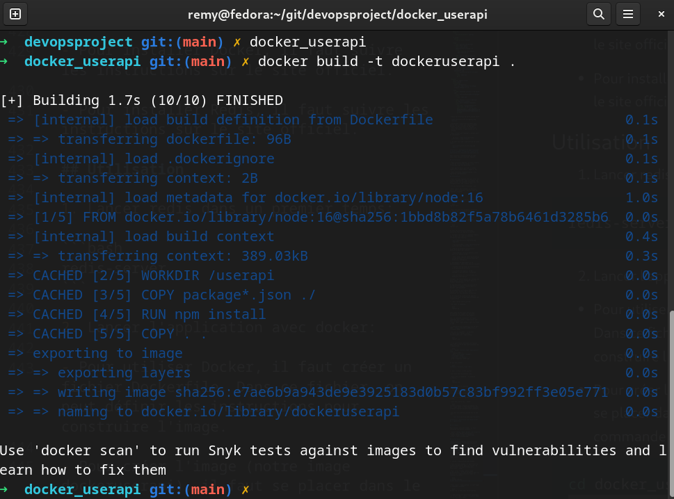
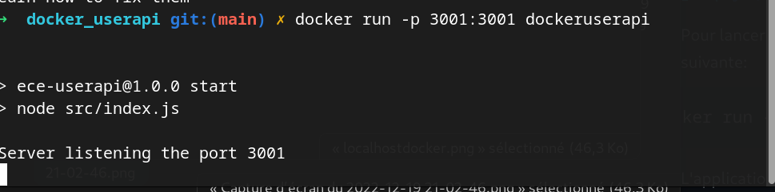

# Devopsproject

## Introduction

## Instructions pour installation

1. [Installer Git](https://git-scm.com/downloads)

2. [Installer NodeJS](https://nodejs.org/en/download/)

3. [Installer Docker](https://docs.docker.com/engine/install/)

# Partie 1 - Créer une application Web.

## Prérequis

- NodeJS
- Git
- Redis

## Installation

1. Cloner le projet

```bash
git clone git@github.com:aym00n-djrak/devopsproject.git
```

3. Se déplacer dans le dossier du projet

```bash
cd devopsproject
```

4. Puis dans l'api: userapi

```bash
cd userapi
```

5. Installer les dépendances

```bash
npm install
```

6. Lancer Redis

```bash
redis-server
```

- Résultat attendu:

  

6. Lancer les tests

```bash
npm test
```

- Résultat attendu:

  

7. Lancer l'application finale

```bash
npm start
```

- Résultat attendu:

  

- Sortie sur le navigateur: [localhost:3000](http://localhost:3000)

  

- On peut effectuer une commande curl pour observer si la base de données Redis est bien remplie:

```bash
curl --header "Content-Type: application/json" \
  --request POST \
  --data '{"username":"Aym00n","firstname":"Remy","lastname":"Jovanovic"}' \
  http://localhost:3000/user
```

- Sortie sur le terminal:

  

# Partie 2 - Appliquer une Pipeline CI/CD.

## Prérequis

- Github
- Heroku
- Azure

## Installation

1. Se déplacer dans le dossier du projet

```bash
cd devopsproject
```

2. En utilisant Github Actions, on peut voir que la pipeline est bien lancée :

   

## Heroku :

1. On observe ci dessous le workflow de la pipeline Heroku:

   

- Ici le code du workflow est le suivant:

```yaml
name: Node.js CI

on:
  push:
    branches: ["main"]
  pull_request:
    branches: ["main"]

jobs:
  test:
    runs-on: ubuntu-latest
    defaults:
      run:
        working-directory: userapi

    strategy:
      matrix:
        node-version: [16.x]
        # See supported Node.js release schedule at https://nodejs.org/en/about/releases/
        redis-version: [6]

    steps:
      - uses: actions/checkout@v3
      - name: Start Redis
        uses: supercharge/redis-github-action@1.4.0
        with:
          redis-version: ${{ matrix.redis-version }}

      - name: Use Node.js ${{ matrix.node-version }}
        uses: actions/setup-node@v3
        with:
          node-version: ${{ matrix.node-version }}
          cache: "npm"
          cache-dependency-path: "**/package-lock.json"
      - run: npm ci
      - run: npm run build --if-present
      - run: npm test

  deploy:
    needs: test
    runs-on: ubuntu-latest

    steps:
      - uses: actions/checkout@v2
      - uses: akhileshns/heroku-deploy@v3.12.12 # This is the action
        with:
          heroku_api_key: ${{secrets.HEROKU_API_KEY}}
          heroku_app_name: "devopsprojectjovayu" #Must be unique in Heroku
          heroku_email: "remyj@outlook.fr"
          appdir: userapi
```

2. On peut voir que la pipeline est bien lancée sur Heroku:

   

- Sur le lien de l'application:

  

- L'application est actuellement désactivée suite au dépassement de la limite de temps d'utilisation gratuite de Heroku.

- L'application est aujourd'hui payante et les services Redis sont désactivés.

- L'application est donc désactivée (pour ne pas engendrer des frais supplémentaires).

## Azure :

1. On observe ci dessous le workflow de la pipeline Azure:

   

- Ici le code du workflow est le suivant:

```yaml
# Docs for the Azure Web Apps Deploy action: https://github.com/Azure/webapps-deploy
# More GitHub Actions for Azure: https://github.com/Azure/actions

name: Build and deploy Node.js app to Azure Web App - DevopsECEProject

on:
  push:
    branches:
      - main
  workflow_dispatch:

jobs:
  build:
    runs-on: ubuntu-latest
    defaults:
      run:
        working-directory: userapi

    strategy:
      matrix:
        node-version: [16.x]

    steps:
      - uses: actions/checkout@v2
      - name: Start Redis
        uses: supercharge/redis-github-action@1.4.0
        with:
          redis-version: ${{ matrix.redis-version }}

      - name: Set up Node.js version
        uses: actions/setup-node@v1
        with:
          node-version: "16.x"

      - name: npm install, build, and test
        run: |
          npm install
          npm run build --if-present
          npm run test --if-present
      - name: Upload artifact for deployment job
        uses: actions/upload-artifact@v2
        with:
          name: node-app
          path: .

  deploy:
    runs-on: ubuntu-latest
    needs: build
    environment:
      name: "Production"
      url: ${{ steps.deploy-to-webapp.outputs.webapp-url }}

    steps:
      - name: Download artifact from build job
        uses: actions/download-artifact@v2
        with:
          name: node-app

      - name: "Deploy to Azure Web App"
        id: deploy-to-webapp
        uses: azure/webapps-deploy@v2
        with:
          app-name: "DevopsECEProject"
          slot-name: "Production"
          publish-profile: ${{ secrets.AZUREAPPSERVICE_PUBLISHPROFILE_4FD3A5384FCE443E9F4C572405944A5C }}
          package: .
```

- Voici la structure de notre groupe Azure:

  

- Concernant l'insertion de Redis dans Azure, nous n'avons pas compris comment ajouter le service dans la Web App.
  Nous avons donc ajouté le module au group et déployé l'application sur le groupe.

- Nous n'avons pas remarqué d'erreur lors du déployement.

  - Le voici: 

2. On peut voir que l'application est bien lancé:

   

# Partie 3 - Configurer et approvisionner un environnement virtuel qui lance notre application en utilisant une approche IaC.

Pour utiliser l'infrastucture as code, nous avons choisi d'utiliser Vagrant.

## Installation

- Pour installer Vagrant, il faut d'abord installer [VirtualBox](https://www.virtualbox.org/wiki/Downloads).

- Vous pouvez aussi utiliser d'autres hyperviseurs comme VMware, Hyper-V, etc.

- Puis installer [Vagrant](https://www.vagrantup.com/downloads).

## Utilisation

- Pour utiliser Vagrant, il faut créer un fichier Vagrantfile. Dans ce fichier, on peut définir les machines virtuelles, les configurations, les réseaux, etc.

- Il se trouvera dans le dossier /IaC.

- Pour lancer les fichiers il faut se placer dans le dossier /IaC et taper la commande suivante:

```bash
vagrant up
```

- Pour arrêter les machines virtuelles, il faut taper la commande suivante:

```bash
vagrant halt
```

- Pour détruire les machines virtuelles, il faut taper la commande suivante:

```bash
vagrant destroy
```

- Pour se connecter à une machine virtuelle, il faut taper la commande suivante:

```bash
vagrant ssh
```

Ce sont les différentes commandes utilisées tout au long de la partie.

1. Lorsque l'on lance la commande vagrant up, on peut voir que les machines virtuelles sont lancées:

   

   - Sur VirtualBox : 

2. L'OS de la machine virtuelle est Bionic64 proposé par Vagrant.

   - Bionic64 est une distribution Linux basée sur Ubuntu 18.04

   - Nous avons choisit cette distribution puisqu'elle est très utilisé dans le monde de l'entreprise.

3. Concernant le deployment et le provisionement, nous avons utilisé Ansible.

   - Ansible est un outil de configuration et de gestion de serveurs.

   - Il permet de déployer et de configurer des machines virtuelles.

   - Il est aussi très utilisé dans le monde de l'entreprise.

Lorsque l'on lance vagrant up, Ansible est aussi lancé, il est configuré dasn le fichier Vagrantfile.

Il approvisionne la mise en place grâce aux Ansible Playbooks contenu dans le dossier /IaC/playbooks.

Un playbook est un fichier YAML qui est utilisé pour décrire les tâches à effectuer sur les machines virtuelles.

Il télécharge et installe les paquets nécessaires pour le bon fonctionnement de l'application.

4.  Pour tester notre système:

- On lance la commande:

```bash
   vagrant up
```

Cela prend un peu temps car il faut télécharger les images des machines virtuelles et installer les paquets.

Ici, la commande a effectué les memes commandes pour lancer l'application que dans la partie 1.
(Lancer redis, npm install, npm start dans la VM)

- l'appication est disponible sur le port 3000 : [http://localhost:3000](http://localhost:3000)

- On peut se connecte à la machine virtuelle pour tester le bon fonctionnement de l'application:

```bash
   vagrant ssh
```

- L'on peut aussi effectuer une requete CURL pour tester le bon fonctionnement de l'application:

```bash
curl --header "Content-Type: application/json" \
  --request POST \
  --data '{"username":"Aym00n","firstname":"Remy","lastname":"Jovanovic"}' \
  http://localhost:3000/user
```

Ce qui nous donne:

```bash
{"status":"success","msg":"OK"}
```

5. Pour vérifier l'état système

- On reste dans le dossier /IaC

- Puis l'on se connecte à la machine virtuelle:

```bash
   vagrant ssh
```

- Et l'on tape la commande:

```bash
ansible-playbook /vagrant/playbooks/run.yml --tags TAG -i /tmp/vagrant-ansible/inventory/vagrant_ansible_local_inventory
```

- TAG est le nom du tag que l'on veut tester.

- Donc dans notre cas : check

```bash
ansible-playbook /vagrant/playbooks/run.yml --tags check -i /tmp/vagrant-ansible/inventory/vagrant_ansible_local_inventory
```

- On peut voir que le système est en bon état:

  

# Partie 4 - Construire une Image Docker de l'application.

## Prérequis

Pour pouvoir utiliser Docker, il faut installer les outils suivants:

- Docker [https://docs.docker.com/install/](https://docs.docker.com/install/)
- Redis [https://redis.io/download](https://redis.io/download)

## Installation

- Pour installer Docker, il faut suivre les instructions sur le site officiel.

- Pour installer Redis, il faut suivre les instructions sur le site officiel.

## Utilisation

1. Lancer redis dans un premier temps:

```bash
redis-server
```

2. Lancer l'application avec docker:

- Pour utiliser Docker, il faut créer un fichier Dockerfile. Dans ce fichier, on peut définir les instructions pour construire l'image.

- Pour créer l'image (notre image dockeruserapi), il faut se placer dans le dossier de l'application et taper la commande suivante:

```bash
cd docker_userapi
docker build -t dockeruserapi .
```

- sortie de la commande:



- Pour lancer l'application, il faut taper la commande suivante:

```bash
docker run -p 3001:3001 dockeruserapi
```

- sortie de la commande:



- L'application est maintenant disponible sur le port 3001 : [http://localhost:3001](http://localhost:3001)


- Sur l'adresse :

 

## Utilisation de l'image Docker Hub

- Pour envoyer l'image sur Docker Hub, il faut se connecter à son compte Docker Hub.

- Puis taper la commande suivante:

```bash
docker login
```

- Ensuite, il faut tagger l'image avec le nom de l'utilisateur Docker Hub:

```bash
docker tag dockeruserapi aym00n/dockeruserapi
```

- Enfin, il faut envoyer l'image sur Docker Hub:

```bash
docker push aym00n/dockeruserapi
```

- On l'observe sur le site Docker: 


- Pour utiliser l'image Docker Hub, il faut taper la commande suivante:

```bash
docker pull aym00n/dockeruserapi
```

- Puis lancer l'application avec docker:

```bash
docker run -p 3001:3001 aym00n/dockeruserapi
```

- L'application est maintenant disponible sur le port 3001 : [http://localhost:3001](http://localhost:3001)

On peut la tester avec la méthode CURL que pour IaC.

# Partie 5 - Créer l'orchestration d'un conteneur en utilisant Docker Compose.

## Prérequis

Pour pouvoir utiliser Docker Compose, il faut installer les outils suivants:

- [Docker](https://docs.docker.com/install/)
- [Docker Compose](https://docs.docker.com/compose/install/)
- [Redis](https://redis.io/download)

## Installation

- Pour installer Docker, il faut suivre les instructions sur le site officiel.

- Pour installer Docker Compose, il faut suivre les instructions sur le site officiel.

- Pour installer Redis, il faut suivre les instructions sur le site officiel.

## Utilisation

- Pour utiliser Docker Compose, il faut créer un fichier docker-compose.yml. Dans ce fichier, on peut définir les instructions pour construire l'image et lancer l'application.

- Pour créer l'image et lancer l'application, il faut se placer dans le dossier de l'application et taper la commande suivante:

```bash
cd dockercompose_userapi
docker-compose up
```

- sortie de la commande:


- L'application est maintenant disponible sur le port 3001 : [http://localhost:3001](http://localhost:3001)

 

- Pour arrêter l'application, il faut taper la commande suivante:

```bash
docker-compose down
```

- On peut la tester avec la méthode CURL suivante :

  ```bash
  curl --header "Content-Type: application/json" \
    --request POST \
    --data '{"username":"Aym00n","firstname":"Remy","lastname":"Jovanovic"}' \
    http://localhost:3001/user
  ```

- La réponse est la suivante :

  ```bash
  {"status": "success", "msg": "OK"}
  ```

# Partie 6 - Faire l'orchestration Docker en utilisant Kubernetes.

## Prérequis

Pour pouvoir utiliser Kubernetes, il faut installer les outils suivants:

- [Kubernetes](https://kubernetes.io/docs/tasks/tools/install-kubectl/)
- [Minikube](https://kubernetes.io/docs/tasks/tools/install-minikube/)
- [Redis](https://redis.io/download)
- Hyperviseur : [VirtualBox](https://www.virtualbox.org/wiki/Downloads) , [Hyper-V](https://docs.microsoft.com/en-us/virtualization/hyper-v-on-windows/quick-start/enable-hyper-v), [Docker](https://docs.docker.com/install/) etc
- [kubectl](https://kubernetes.io/docs/tasks/tools/install-kubectl/)

## Installation

- Pour mettre en place un cluster Kubernetes, il faut installer Minikube. Pour cela, il faut suivre les instructions sur le site officiel.

- Pour lancer miniKube, il faut taper la commande suivante:

```bash
minikube start
```

- Cela va créer un cluster Kubernetes avec un noeud.

- Ici on utilise le driver VirtualBox. En amont de la partie 7 et 8.

- Le rendu est le suivant:


- Pour verifier que le cluster est bien lancé, il faut taper la commande suivante:

```bash
kubectl get nodes
```

- Le rendu est le suivant:


- Diriger vous dans le dossier k8s du dossier cloné.

- On va créer des images grâce à Dockerfile et les déployer sur le cluster Kubernetes.

- On rend l'image disponible sur le cluster Kubernetes avant toute chose:

```bash
eval $(minikube docker-env)
```

- Pour créer l'image et lancer l'application, il faut se placer dans le dossier de l'application et taper la commande suivante:

```bash
docker build -t userapi-node .
```

- On verifie que l'image est bien créée:

```bash
minikube ssh
docker images
exit
```

- On peut ensuite déployer l'application sur le cluster Kubernetes et appliquer les fichiers yaml:

```bash
cd yamlfiles
kubectl apply -f deployment.yaml
kubectl apply -f service.yaml
kubectl apply -f persistentvolume.yaml
kubectl apply -f persistentvolumeclaim.yaml
```

- On peut vérifier que l'application est bien déployée sur le cluster Kubernetes:

```bash
kubectl get pods
kubectl get deployments
kubectl get services
kubectl get pv
kubectl get pvc
```

- On peut ouvrir les ports sur le navigateur avec la fonction

```bash
minikube service userapi-service --url
```

On obtient l'adresse sur laquelle l'application est disponible.

Par exemple, ici l'adresse disponible est : [http://127.0.0.1:34785](http://127.0.0.1:34785), le port change souvent il faut faire attention !

 

- Pour ensuite rediriger l'application sur le port 3001, il faut taper la commande suivante:

```bash
kubectl port-forward service/userapi-service 3001:3001
```

-Resultat:


- Dashboard Kubernetes:

```bash
minikube dashboard
```

- Le rendu est le suivant:


Il est utilisé pour visualiser les ressources du cluster Kubernetes. Pour vérifier que tout fonctionne bien.

# Partie 7 - Créer un service mesh en utilisant Istio.

- Istio est un service mesh qui permet de gérer les communications entre les microservices.

- Pour utiliser Istio, il faut réaliser différentes étapes:

  - Installer Istio sur le cluster Kubernetes.
  - Déployer l'application sur le cluster Kubernetes.
  - Configurer Istio pour gérer les communications entre les microservices.

## Initialisation

1. Installer [kubectl](https://kubernetes.io/docs/tasks/tools/install-kubectl/)

2. Installer un provider de Kubernetes. On utilise ici [minikube](https://kubernetes.io/docs/tasks/tools/install-minikube/).

3. Installer un hyperviseur. On utilise ici [VirtualBox](https://www.virtualbox.org/wiki/Downloads).


## Installation d'Istio


- Il faut demarrer minikube sur l'hyperviseur VirtualBox avec le maximum de ressources possibles:

```bash
minikube start --driver=virtualbox --memory=14000 --cpus=4
```

- On verifie que tout fonctionne bien:

```bash
minikube status
```

- On initialise ensuite minikube en mode tunnel:

```bash
minikube tunnel
```

Cela permet par exemple de lancer des commandes dans le cluster Kubernetes depuis un autre terminal.

Il créé une route / un tunnel entre le cluster Kubernetes et notre machine.

- On installe ensuite Istio:

```bash
curl -L https://istio.io/downloadIstio | sh -
```

- On se place dans le dossier d'installation d'Istio:

```bash
cd istio-1.16.1
```

- On ajoute le chemin d'installation d'Istio dans le PATH:

```bash
export PATH=$PWD/bin:$PATH
```

- On vérifie que tout fonctionne bien:

```bash
istioctl version
```

- On installe ensuite la demo de Istio sur le cluster Kubernetes:

```bash
istioctl install --set profile=demo
```

-Sortie:


- On vérifie que tout fonctionne bien:

```bash
kubectl get pods -n istio-system
```

Sortie:

```bash
NAME                                    READY   STATUS    RESTARTS   AGE
istio-egressgateway-79598956cf-8wbvz    1/1     Running   0          104s
istio-ingressgateway-854c9d9c5f-kcz2b   1/1     Running   0          104s
istiod-fd94754fb-x47zd                  1/1     Running   0          2m2s
```


## Déploiement de l'application

- On garde pour tout le reste de la partie la configuration de minikube et Istio.

- On se place dans le dossier istio.

- On ajoute le port 3001 dans la Gateway Ingress:

```bash
cd yamlfiles
istioctl install -f 3001.yaml
```

## Request Routing

- Avec minikube, on charge les fichiers yaml de l'application:

```bash
kubectl apply -f deployment-redis.yaml
kubectl apply -f deployment-userapi.yaml
kubectl apply -f gateway.yaml
kubectl apply -f destinationrule.yaml
kubectl apply -f virtual-service-v1.yaml
```

- On vérifie que tout fonctionne bien:

```bash
istioctl analyze
```

Si jamais il y a une erreur, il faut vérifier que les fichiers yaml sont bien chargés.
Et lancer cette commande: 
  
```bash
kubectl label namespace default istio-injection=enabled
```


- Pour avoir l'adresse de l'application, on utilise la commande suivante:

```bash
export INGRESS_HOST=$(kubectl -n istio-system get service istio-ingressgateway -o jsonpath='{.status.loadBalancer.ingress[0].ip}')
export INGRESS_PORT=$(kubectl -n istio-system get service istio-ingressgateway -o jsonpath='{.spec.ports[?(@.name=="userapi")].port}')
export GATEWAY_URL=$INGRESS_HOST:$INGRESS_PORT
echo $GATEWAY_URL
```

- Obtenir la version 1 de l'application:

```bash
curl -s http://$GATEWAY_URL/
```

On route directement sur la version 1 de l'application.

- Pour obtenir la version 2 de l'application, il faut modifier le fichier virtual-service-v1.yaml.
Ici on applique un nouveau fichier virtual-service-v2.yaml.

```bash
kubectl apply -f virtual-service-v2.yaml
```

- Pour obtenir l'adresse

```bash
curl -s http://$GATEWAY_URL/
```


## Traffic Shifting

Pour faire un traffic shifting, il faut modifier le fichier virtual-service-v1-v2.yaml.

On modifie la valeur de weight de 100 à 50 pour la version 1 et de 0 à 50 pour la version 2.

- On execute ensuite la commande suivante:

```bash
kubectl apply -f virtual-service-v1-v2.yaml
```

Cela sert a modifier le traffic de manière a envoyer 50% du traffic vers la version 1 et 50% vers la version 2.

Tout cela est variable en fonction de la valeur de weight.

Sur les fichiers yaml, virtual-service-v1.yaml et virtual-service-v2.yaml, on peut voir que la valeur de weight est de 100, puisqu'elle n'est pas inscrite, c'est la valeur par défaut.


# Partie 8 - Implémenter un système de monitoring en utilisant Prometheus et Grafana.

## Installation de Prometheus

- Il faut demarrer minikube sur l'hyperviseur VirtualBox avec le maximum de ressources possibles:

```bash
minikube start --driver=virtualbox --memory=14000 --cpus=4
```

- On se place dans le dossier d'installation d'Istio et on le lance comme pour la partie 7:


- On installe helm pour installer Prometheus:

```bash
brew install helm
```

- On crée un espace de monitoring:

```bash
kubectl create namespace monitoring
```

- On installe kube-prometheus-stack avec helm:

```bash
helm repo add prometheus-community https://prometheus-community.github.io/helm-charts
helm repo update 
```

- On deploie ensuit kube-prometheus-stack:

```bash
helm upgrade --namespace monitoring --install kube-stack-prometheus prometheus-community/kube-prometheus-stack --set prometheus-node-exporter.hostRootFsMount.enabled=false
```

- On verifie que tout fonctionne bien:

```bash
kubectl get -n monitoring crds
kubectl get pods -n monitoring    
```

- On expose le service de Prometheus:

```bash
kubectl port-forward --namespace monitoring svc/kube-stack-prometheus-kube-prometheus 9090:9090
```

- Le service est maintenant accessible sur le port 9090. A l'adresse: [http://localhost:9090](http://localhost:9090)

- On peut voir que Prometheus est bien installé:


## Installation de Grafana

- On installe ensuite Grafana:

```bash
helm repo add grafana https://grafana.github.io/helm-charts
helm install grafana grafana/grafana
```

- On expose le service de Grafana:

```bash
kubectl expose service grafana --type=NodePort --target-port=3000 --name=grafana-np
```

- On verifie que tout fonctionne bien:

```bash
kubectl get services
```

Sortie: 
  
  

- On obtient les informations admin avec :
  
  ```bash
  kubectl get secret --namespace default grafana -o jsonpath="{.data.admin-password}" | base64 --decode ; echo
  ```

- On peut acceder à l'interface de Grafana avec l'adresse suivante:

```bash
minikube service grafana-np --url
```

- Sur internet:

  


- On se connecte avec l'identifiant: "admin" et le mot de passe obtenu précédemment.

- On obtient alors le dashboard suivant:

  

- On rajoute ensuite en data source Prometheus:

  

- On configure le dashboard à partir d'import et on active les alertes:

  


## Lier Prometheus, Grafana et userapi

- On se place dans le dossier k8s et on deploie userapi comme à la partie 6.

- Une fois déployé on peut selectionner la userapi sur prometheus.

- On lie ensuite Prometheus et Grafana:

  


- On obtient alors un dashboard avec les informations de Prometheus.

  

- On peut ensuite créer des alertes et des statistiques sur les requêtes envoyées à userapi.

## Auto évalutation

| Subject                                                         |   Code    | Max. grade| My Grade  |
|:----------------------------------------------------------------|:---------:|:---------:|:---------:|
| Enriched web application with automated tests                   |   APP     |    +1     |    +1     |
| Continuous Integration and Continuous Delivery (and Deployment) |   CICD    |    +3     |    +2     |
| Containerisation with Docker                                    |   D       |    +1     |    +1     |
| Orchestration with Docker Compose                               |   DC      |    +2     |    +2     |
| Orchestration with Kubernetes	                                  |   KUB     |    +3     |    +3     |
| Service mesh using Istio                                        |   IST     |    +2     |    +2     |
| Infrastructure as code using Ansible                            |   IAC     |    +3     |    +3     |
| Monitoring                                                      |   MON     |    +2     |    +1     |
| Accurate project documentation in README.md file                |   DOC     |    +3     |    +3     |
| Each bonus task                                                 |   BNS     |    +1     |    +0     |
| **Total**                                                       |   TOT     |    20     |    18     |

## Auteurs

- Shihao YU shihao.yu@edu.ece.fr
- Rémy JOVANOVIC remy.jovanovic@edu.ece.fr
