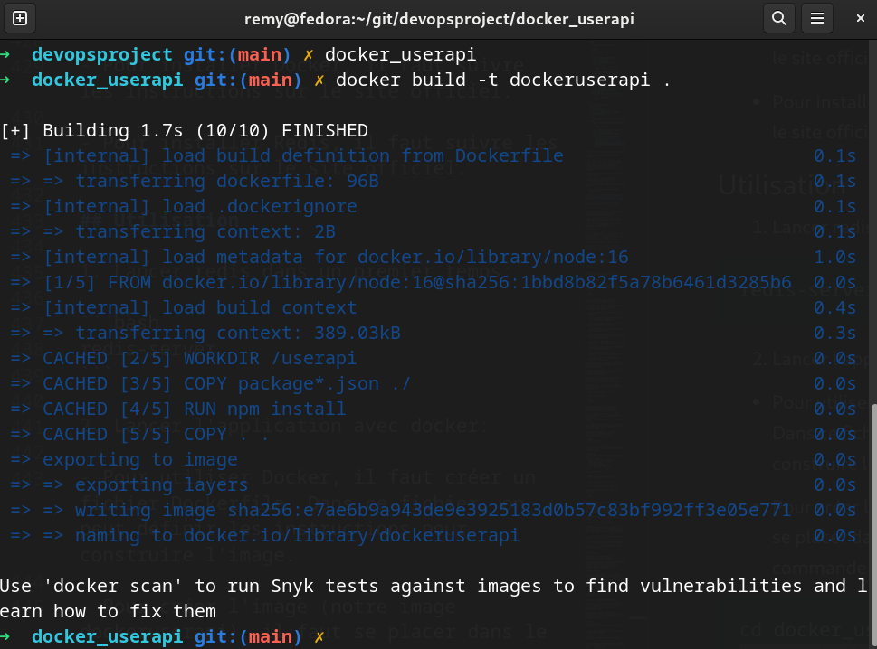
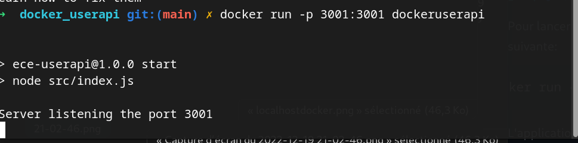
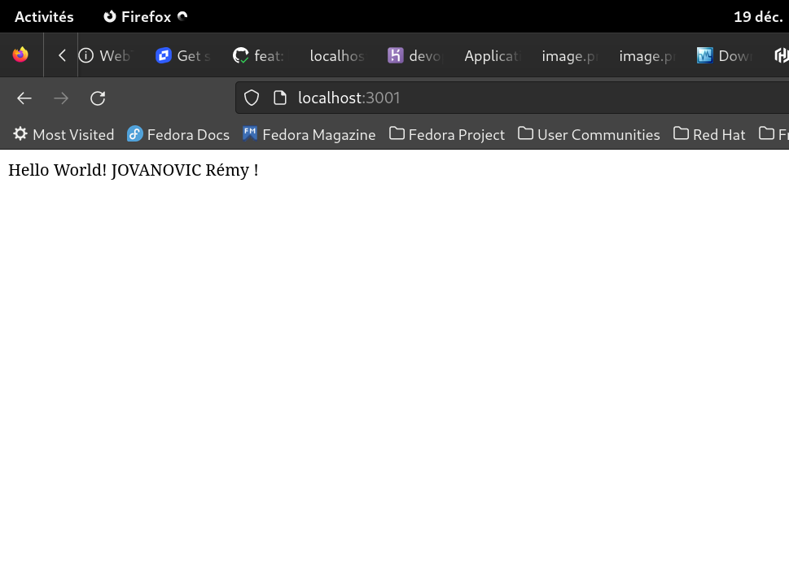
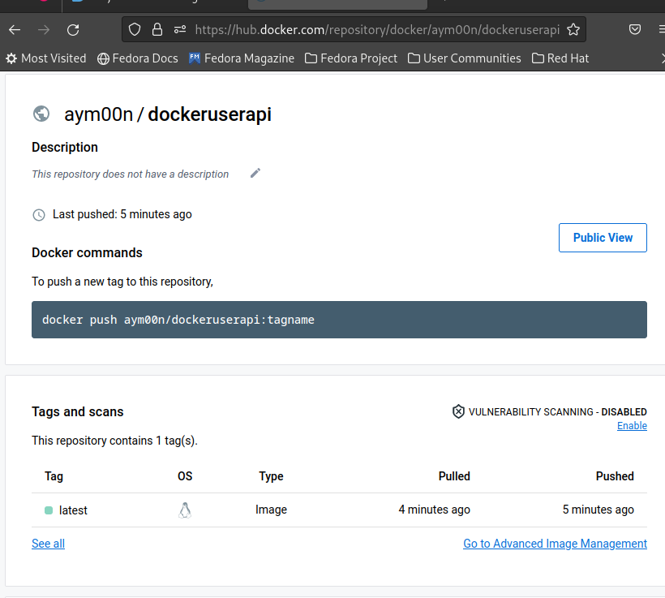

# Partie 4 - Construire une Image Docker de l'application.

## Prérequis

Pour pouvoir utiliser Docker, il faut installer les outils suivants:

- Docker [https://docs.docker.com/install/](https://docs.docker.com/install/)
- Redis [https://redis.io/download](https://redis.io/download)

## Installation

- Pour installer Docker, il faut suivre les instructions sur le site officiel.

- Pour installer Redis, il faut suivre les instructions sur le site officiel.

## Utilisation

1. Lancer redis dans un premier temps:

```bash
redis-server
```

2. Lancer l'application avec docker:

- Pour utiliser Docker, il faut créer un fichier Dockerfile. Dans ce fichier, on peut définir les instructions pour construire l'image.

- Pour créer l'image (notre image dockeruserapi), il faut se placer dans le dossier de l'application et taper la commande suivante:

```bash
cd docker_userapi
docker build -t dockeruserapi .
```

- sortie de la commande:



- Pour lancer l'application, il faut taper la commande suivante:

```bash
docker run -p 3001:3001 dockeruserapi
```

- sortie de la commande:



- L'application est maintenant disponible sur le port 3001 : [http://localhost:3001](http://localhost:3001)


- Sur l'adresse :

 

## Utilisation de l'image Docker Hub

- Pour envoyer l'image sur Docker Hub, il faut se connecter à son compte Docker Hub.

- Puis taper la commande suivante:

```bash
docker login
```

- Ensuite, il faut tagger l'image avec le nom de l'utilisateur Docker Hub:

```bash
docker tag dockeruserapi aym00n/dockeruserapi
```

- Enfin, il faut envoyer l'image sur Docker Hub:

```bash
docker push aym00n/dockeruserapi
```

- On l'observe sur le site Docker: 




- Pour utiliser l'image Docker Hub, il faut taper la commande suivante:

```bash
docker pull aym00n/dockeruserapi
```

- Puis lancer l'application avec docker:

```bash
docker run -p 3001:3001 aym00n/dockeruserapi
```

- L'application est maintenant disponible sur le port 3001 : [http://localhost:3001](http://localhost:3001)

On peut la tester avec la méthode CURL que pour IaC.