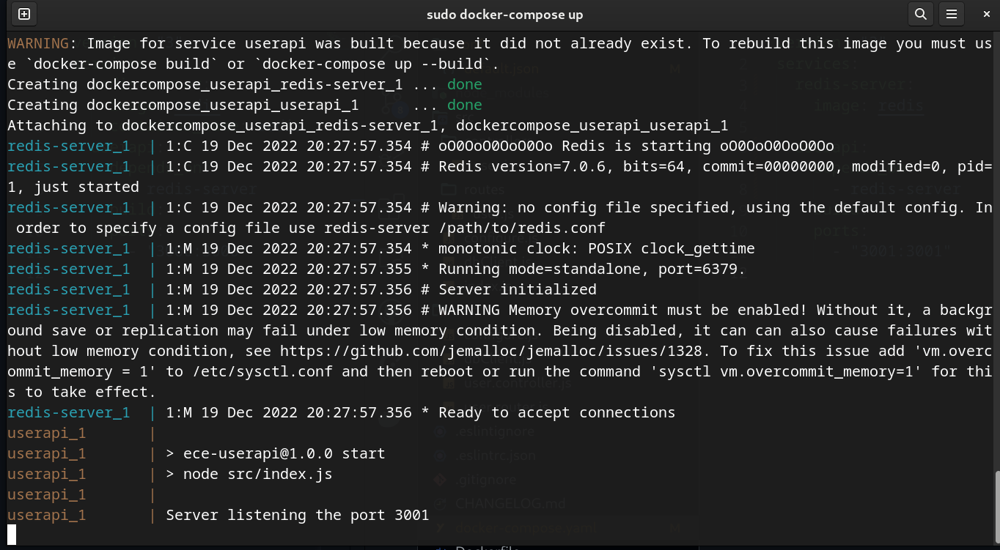

# Partie 5 - Créer l'orchestration d'un conteneur en utilisant Docker Compose.

## Prérequis

Pour pouvoir utiliser Docker Compose, il faut installer les outils suivants:

- [Docker](https://docs.docker.com/install/)
- [Docker Compose](https://docs.docker.com/compose/install/)
- [Redis](https://redis.io/download)

## Installation

- Pour installer Docker, il faut suivre les instructions sur le site officiel.

- Pour installer Docker Compose, il faut suivre les instructions sur le site officiel.

- Pour installer Redis, il faut suivre les instructions sur le site officiel.

## Utilisation

- Pour utiliser Docker Compose, il faut créer un fichier docker-compose.yml. Dans ce fichier, on peut définir les instructions pour construire l'image et lancer l'application.

- Pour créer l'image et lancer l'application, il faut se placer dans le dossier de l'application et taper la commande suivante:

```bash
cd dockercompose_userapi
docker-compose up
```

- sortie de la commande:



- L'application est maintenant disponible sur le port 3001 : [http://localhost:3001](http://localhost:3001)

 

- Pour arrêter l'application, il faut taper la commande suivante:

```bash
docker-compose down
```

- On peut la tester avec la méthode CURL suivante :

  ```bash
  curl --header "Content-Type: application/json" \
    --request POST \
    --data '{"username":"Aym00n","firstname":"Remy","lastname":"Jovanovic"}' \
    http://localhost:3001/user
  ```

- La réponse est la suivante :

  ```bash
  {"status": "success", "msg": "OK"}
  ```
