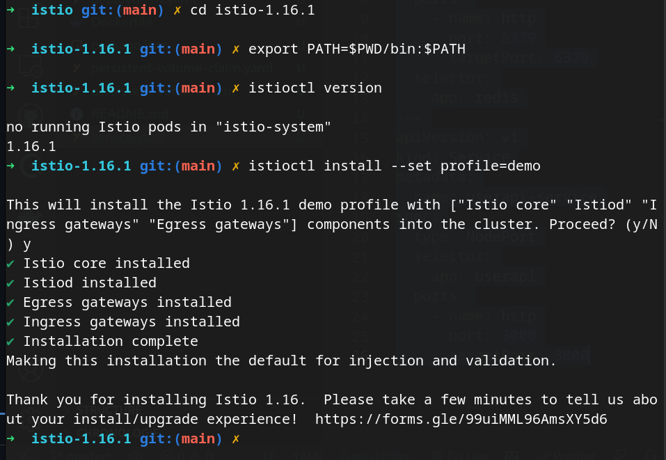

# Partie 7 - Créer un service mesh en utilisant Istio.

- Istio est un service mesh qui permet de gérer les communications entre les microservices.

- Pour utiliser Istio, il faut réaliser différentes étapes:

  - Installer Istio sur le cluster Kubernetes.
  - Déployer l'application sur le cluster Kubernetes.
  - Configurer Istio pour gérer les communications entre les microservices.

## Initialisation

1. Installer [kubectl](https://kubernetes.io/docs/tasks/tools/install-kubectl/)

2. Installer un provider de Kubernetes. On utilise ici [minikube](https://kubernetes.io/docs/tasks/tools/install-minikube/).

3. Installer un hyperviseur. On utilise ici [VirtualBox](https://www.virtualbox.org/wiki/Downloads).


## Installation d'Istio


- Il faut demarrer minikube sur l'hyperviseur VirtualBox avec le maximum de ressources possibles:

```bash
minikube start --driver=virtualbox --memory=14000 --cpus=4
```

- On verifie que tout fonctionne bien:

```bash
minikube status
```

- On initialise ensuite minikube en mode tunnel:

```bash
minikube tunnel
```

Cela permet par exemple de lancer des commandes dans le cluster Kubernetes depuis un autre terminal.

Il créé une route / un tunnel entre le cluster Kubernetes et notre machine.

- On installe ensuite Istio:

```bash
curl -L https://istio.io/downloadIstio | sh -
```

- On se place dans le dossier d'installation d'Istio:

```bash
cd istio-1.16.1
```

- On ajoute le chemin d'installation d'Istio dans le PATH:

```bash
export PATH=$PWD/bin:$PATH
```

- On vérifie que tout fonctionne bien:

```bash
istioctl version
```

- On installe ensuite la demo de Istio sur le cluster Kubernetes:

```bash
istioctl install --set profile=demo
```

-Sortie:




- On vérifie que tout fonctionne bien:

```bash
kubectl get pods -n istio-system
```

Sortie:

```bash
NAME                                    READY   STATUS    RESTARTS   AGE
istio-egressgateway-79598956cf-8wbvz    1/1     Running   0          104s
istio-ingressgateway-854c9d9c5f-kcz2b   1/1     Running   0          104s
istiod-fd94754fb-x47zd                  1/1     Running   0          2m2s
```


## Déploiement de l'application

- On garde pour tout le reste de la partie la configuration de minikube et Istio.

- On se place dans le dossier istio.

- On ajoute le port 3001 dans la Gateway Ingress:

```bash
cd yamlfiles
istioctl install -f 3001.yaml
```

## Request Routing

- Avec minikube, on charge les fichiers yaml de l'application:

```bash
kubectl apply -f deployment-redis.yaml
kubectl apply -f deployment-userapi.yaml
kubectl apply -f gateway.yaml
kubectl apply -f destinationrule.yaml
kubectl apply -f virtual-service-v1.yaml
```

- On vérifie que tout fonctionne bien:

```bash
istioctl analyze
```

Si jamais il y a une erreur, il faut vérifier que les fichiers yaml sont bien chargés.
Et lancer cette commande: 
  
```bash
kubectl label namespace default istio-injection=enabled
```


- Pour avoir l'adresse de l'application, on utilise la commande suivante:

```bash
export INGRESS_HOST=$(kubectl -n istio-system get service istio-ingressgateway -o jsonpath='{.status.loadBalancer.ingress[0].ip}')
export INGRESS_PORT=$(kubectl -n istio-system get service istio-ingressgateway -o jsonpath='{.spec.ports[?(@.name=="userapi")].port}')
export GATEWAY_URL=$INGRESS_HOST:$INGRESS_PORT
echo $GATEWAY_URL
```

- Obtenir la version 1 de l'application:

```bash
curl -s http://$GATEWAY_URL/
```

On route directement sur la version 1 de l'application.

- Pour obtenir la version 2 de l'application, il faut modifier le fichier virtual-service-v1.yaml.
Ici on applique un nouveau fichier virtual-service-v2.yaml.

```bash
kubectl apply -f virtual-service-v2.yaml
```

- Pour obtenir l'adresse

```bash
curl -s http://$GATEWAY_URL/
```


## Traffic Shifting

Pour faire un traffic shifting, il faut modifier le fichier virtual-service-v1-v2.yaml.

On modifie la valeur de weight de 100 à 50 pour la version 1 et de 0 à 50 pour la version 2.

- On execute ensuite la commande suivante:

```bash
kubectl apply -f virtual-service-v1-v2.yaml
```

Cela sert a modifier le traffic de manière a envoyer 50% du traffic vers la version 1 et 50% vers la version 2.

Tout cela est variable en fonction de la valeur de weight.

Sur les fichiers yaml, virtual-service-v1.yaml et virtual-service-v2.yaml, on peut voir que la valeur de weight est de 100, puisqu'elle n'est pas inscrite, c'est la valeur par défaut.

