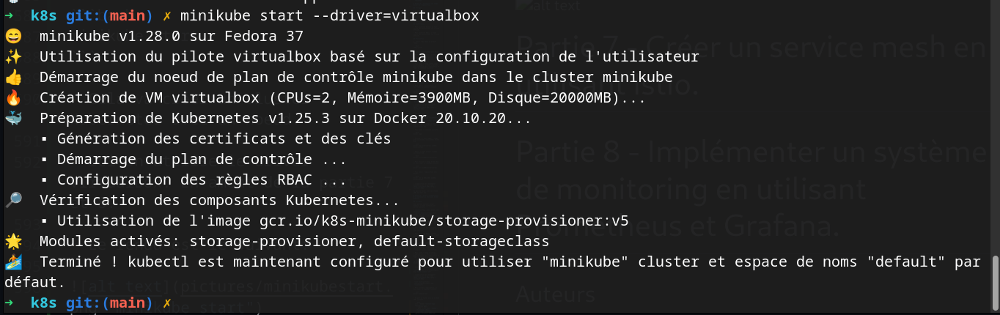
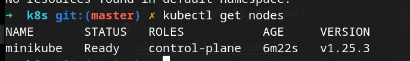
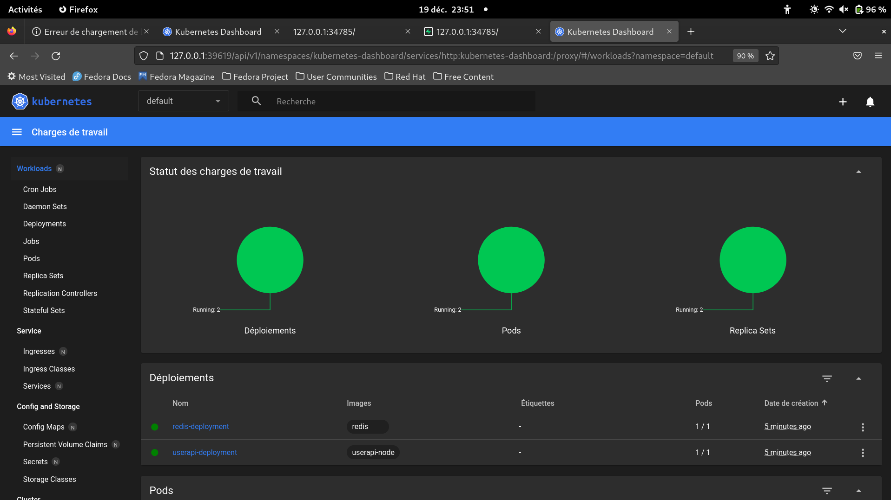

# Partie 6 - Faire l'orchestration Docker en utilisant Kubernetes.

## Prérequis

Pour pouvoir utiliser Kubernetes, il faut installer les outils suivants:

- [Kubernetes](https://kubernetes.io/docs/tasks/tools/install-kubectl/)
- [Minikube](https://kubernetes.io/docs/tasks/tools/install-minikube/)
- [Redis](https://redis.io/download)
- Hyperviseur : [VirtualBox](https://www.virtualbox.org/wiki/Downloads) , [Hyper-V](https://docs.microsoft.com/en-us/virtualization/hyper-v-on-windows/quick-start/enable-hyper-v), [Docker](https://docs.docker.com/install/) etc
- [kubectl](https://kubernetes.io/docs/tasks/tools/install-kubectl/)

## Installation

- Pour mettre en place un cluster Kubernetes, il faut installer Minikube. Pour cela, il faut suivre les instructions sur le site officiel.

- Pour lancer miniKube, il faut taper la commande suivante:

```bash
minikube start
```

- Cela va créer un cluster Kubernetes avec un noeud.

- Ici on utilise le driver VirtualBox. En amont de la partie 7 et 8.

- Le rendu est le suivant:




- Pour verifier que le cluster est bien lancé, il faut taper la commande suivante:

```bash
kubectl get nodes
```

- Le rendu est le suivant:



- Diriger vous dans le dossier k8s du dossier cloné.

- On va créer des images grâce à Dockerfile et les déployer sur le cluster Kubernetes.

- On rend l'image disponible sur le cluster Kubernetes avant toute chose:

```bash
eval $(minikube docker-env)
```

- Pour créer l'image et lancer l'application, il faut se placer dans le dossier de l'application et taper la commande suivante:

```bash
docker build -t userapi-node .
```

- On verifie que l'image est bien créée:

```bash
minikube ssh
docker images
exit
```

- On peut ensuite déployer l'application sur le cluster Kubernetes et appliquer les fichiers yaml:

```bash
cd yamlfiles
kubectl apply -f deployment.yaml
kubectl apply -f service.yaml
kubectl apply -f persistentvolume.yaml
kubectl apply -f persistentvolumeclaim.yaml
```

- On peut vérifier que l'application est bien déployée sur le cluster Kubernetes:

```bash
kubectl get pods
kubectl get deployments
kubectl get services
kubectl get pv
kubectl get pvc
```

- On peut ouvrir les ports sur le navigateur avec la fonction

```bash
minikube service userapi-service --url
```

On obtient l'adresse sur laquelle l'application est disponible.

Par exemple, ici l'adresse disponible est : [http://127.0.0.1:34785](http://127.0.0.1:34785), le port change souvent il faut faire attention !

 

- Pour ensuite rediriger l'application sur le port 3001, il faut taper la commande suivante:

```bash
kubectl port-forward service/userapi-service 3001:3001
```

-Resultat:


- Dashboard Kubernetes:

```bash
minikube dashboard
```

- Le rendu est le suivant:




Il est utilisé pour visualiser les ressources du cluster Kubernetes. Pour vérifier que tout fonctionne bien.