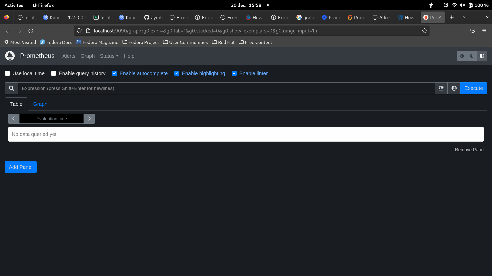
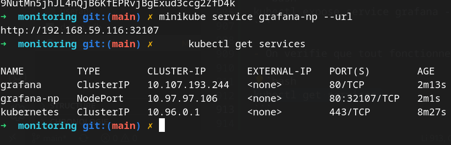
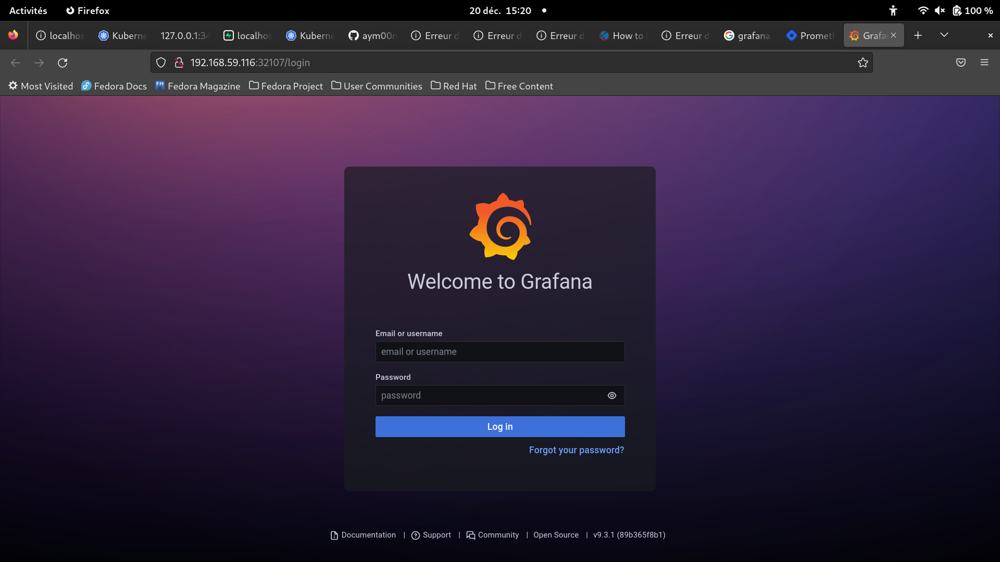
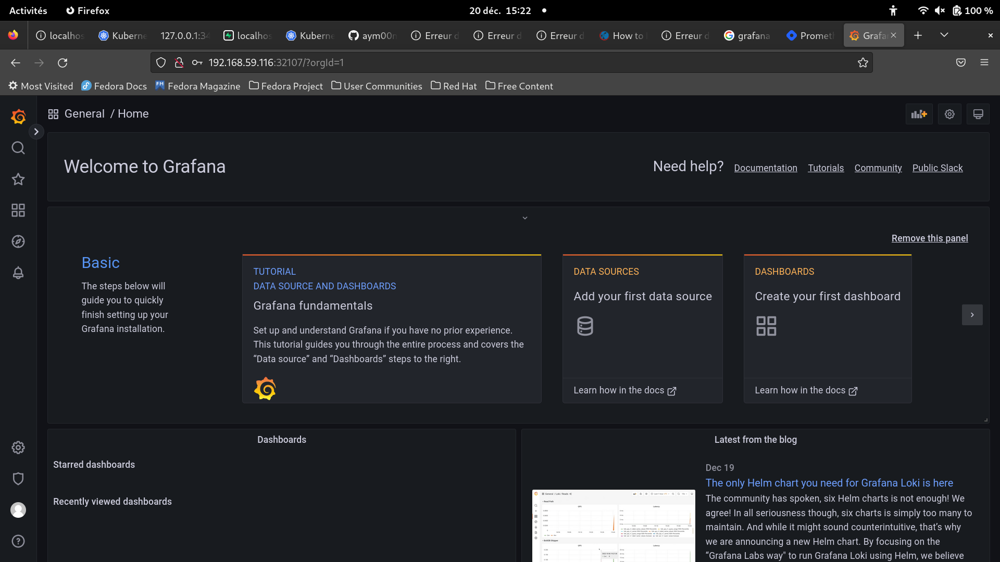
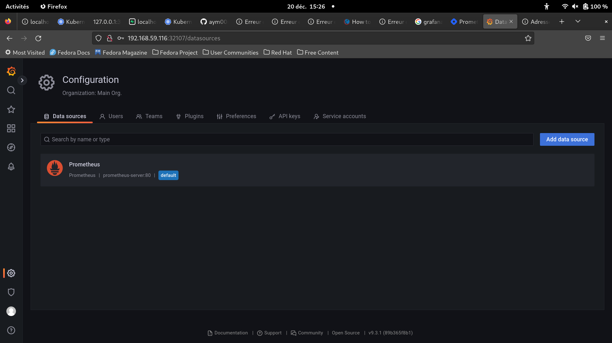
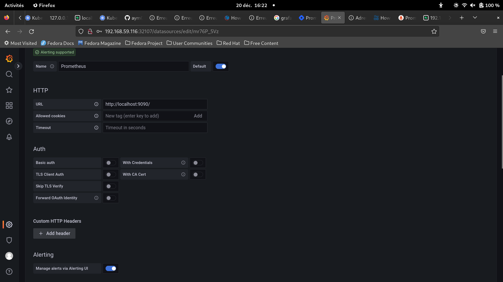
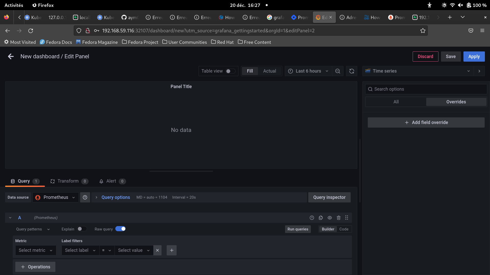

# Partie 8 - Implémenter un système de monitoring en utilisant Prometheus et Grafana.

## Installation de Prometheus

- Il faut demarrer minikube sur l'hyperviseur VirtualBox avec le maximum de ressources possibles:

```bash
minikube start --driver=virtualbox --memory=14000 --cpus=4
```

- On se place dans le dossier d'installation d'Istio et on le lance comme pour la partie 7:


- On installe helm pour installer Prometheus:

```bash
brew install helm
```

- On crée un espace de monitoring:

```bash
kubectl create namespace monitoring
```

- On installe kube-prometheus-stack avec helm:

```bash
helm repo add prometheus-community https://prometheus-community.github.io/helm-charts
helm repo update 
```

- On deploie ensuit kube-prometheus-stack:

```bash
helm upgrade --namespace monitoring --install kube-stack-prometheus prometheus-community/kube-prometheus-stack --set prometheus-node-exporter.hostRootFsMount.enabled=false
```

- On verifie que tout fonctionne bien:

```bash
kubectl get -n monitoring crds
kubectl get pods -n monitoring    
```

- On expose le service de Prometheus:

```bash
kubectl port-forward --namespace monitoring svc/kube-stack-prometheus-kube-prometheus 9090:9090
```

- Le service est maintenant accessible sur le port 9090. A l'adresse: [http://localhost:9090](http://localhost:9090)

- On peut voir que Prometheus est bien installé:



## Installation de Grafana

- On installe ensuite Grafana:

```bash
helm repo add grafana https://grafana.github.io/helm-charts
helm install grafana grafana/grafana
```

- On expose le service de Grafana:

```bash
kubectl expose service grafana --type=NodePort --target-port=3000 --name=grafana-np
```

- On verifie que tout fonctionne bien:

```bash
kubectl get services
```

Sortie: 
  
  

- On obtient les informations admin avec :
  
  ```bash
  kubectl get secret --namespace default grafana -o jsonpath="{.data.admin-password}" | base64 --decode ; echo
  ```

- On peut acceder à l'interface de Grafana avec l'adresse suivante:

```bash
minikube service grafana-np --url
```

- Sur internet:

  


- On se connecte avec l'identifiant: "admin" et le mot de passe obtenu précédemment.

- On obtient alors le dashboard suivant:

  

- On rajoute ensuite en data source Prometheus:

  

- On configure le dashboard à partir d'import et on active les alertes:

  


## Lier Prometheus, Grafana et userapi

- On se place dans le dossier k8s et on deploie userapi comme à la partie 6.

- Une fois déployé on peut selectionner la userapi sur prometheus.

- On lie ensuite Prometheus et Grafana:

  


- On obtient alors un dashboard avec les informations de Prometheus.

  

- On peut ensuite créer des alertes et des statistiques sur les requêtes envoyées à userapi.