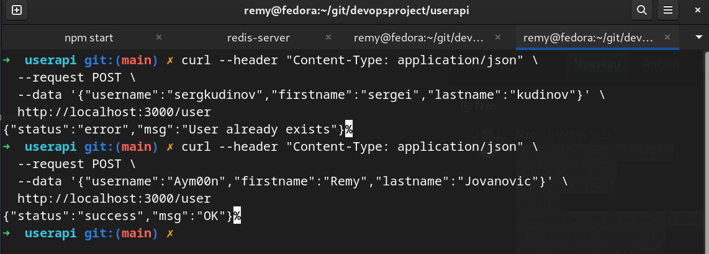

# Partie 1 - Créer une application Web.

## Prérequis

- NodeJS
- Git
- Redis

## Installation

1. Cloner le projet

```bash
git clone git@github.com:aym00n-djrak/devopsproject.git
```

3. Se déplacer dans le dossier du projet

```bash
cd devopsproject
```

4. Puis dans l'api: userapi

```bash
cd userapi
```

5. Installer les dépendances

```bash
npm install
```

6. Lancer Redis

```bash
redis-server
```

- Résultat attendu:

  

6. Lancer les tests

```bash
npm test
```

- Résultat attendu:

  

7. Lancer l'application finale

```bash
npm start
```

- Résultat attendu:

  

- Sortie sur le navigateur: [localhost:3000](http://localhost:3000)

  

- On peut effectuer une commande curl pour observer si la base de données Redis est bien remplie:

```bash
curl --header "Content-Type: application/json" \
  --request POST \
  --data '{"username":"Aym00n","firstname":"Remy","lastname":"Jovanovic"}' \
  http://localhost:3000/user
```

- Sortie sur le terminal:

  
